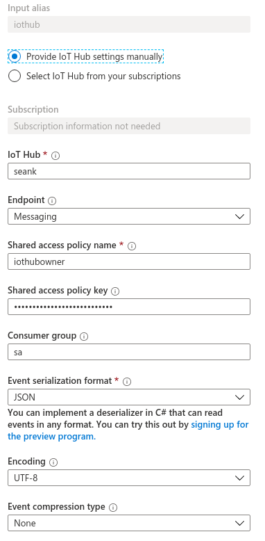
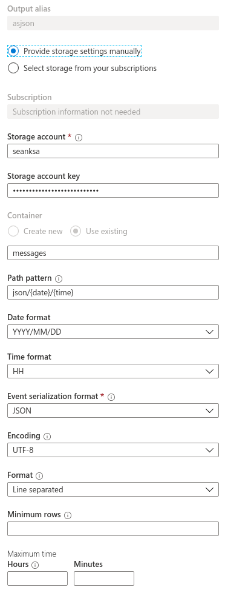

# Azure Scripting

Before running the script you must either install the [Azure CLI](https://github.com/Azure/azure-cli) or pull and run the Docker container with the following command assume you a in the repo's root directory

```
docker run -v ./azure:/root -it azuresdk/azure-cli-python:latest
```

Before you can run the deploy.sh script you'll need to tell the azure cli which subscription you want to use by running

```
az login
```

If this result in a JSON object with more than one subscription you can follow it with a command like the following

```
az account set -s <subscription-id>
```

Now run the deploy script passing the name of the resource group and the vm like so

```
./deploy.sh SeanKResources SeansVM
```

When you are done with the VM run the following to clean up

```
az group delete --name SeanKResources
```

## Streaming Analytics Notes

```SQL
WITH cached as (SELECT * FROM iothub)
SELECT * INTO asjson FROM cached
SELECT * INTO ascsv FROM cached
```

### Inputs:



### Outputs:





## Azure Functions

## Other helpful links

[Azure Accounts](https://account.azure.com/subscriptions)


