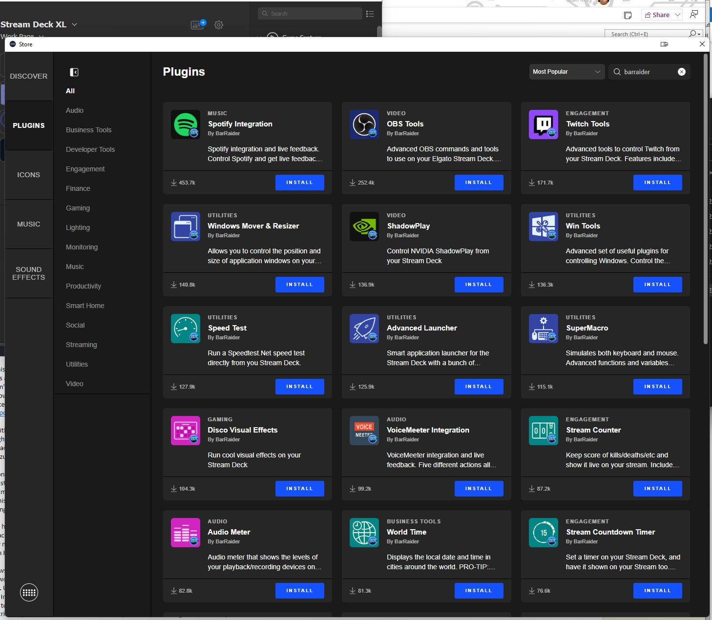
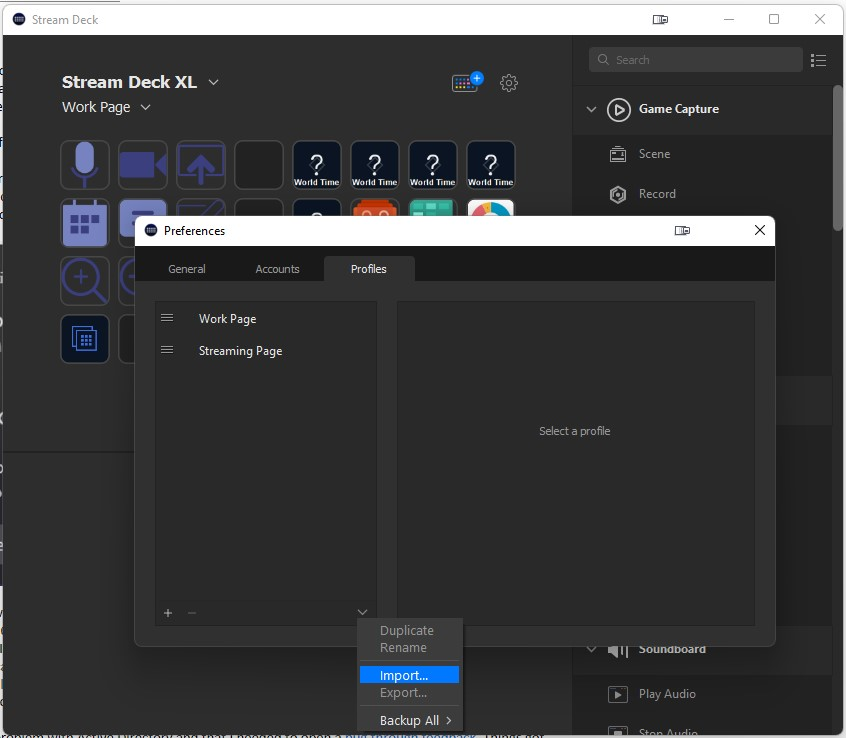

# Windows Configuration

Configuration steps, scripts and tools i use on windows machines. Feel free to skip any steps that don't work for you or add steps if you think something is missing.

### Setting up your development environment

1. Open an elevated command prompt 
    
    (Press <kbd>Win</kbd>, type `Terminal`, right click and select 'Run as administrator') and run the following

    ```
    winget install --id Google.Chrome -e
    winget install --id Dropbox.Dropbox -e
    winget install --id Microsoft.VisualStudio.2022.Community -e
    winget install --id Microsoft.VisualStudioCode -e
    winget install --id Git.Git -e
    winget install --id Microsoft.PowerToys -e
    winget install --id CoreyButler.NVMforWindows -e
    reg add HKLM\SOFTWARE\Microsoft\Windows\CurrentVersion\Policies\System /v EnableLinkedConnections /t REG_DWORD /d 1 /f
    ```

2. Find the Welcome to Power Toys window

    - click the `Open Settings` button
    - select General blade
    - click `Restart PowerToys as administrator`
    - select General blade again
    - check Always run as administrator
    - select FancyZones under Windowing & Layouts
    - click `Open layout editor`
    - click `Create new layout`
    - name it "Grid", click `Grid` and click `Create`
    - arrange at least 2 rows of 4 squares and click `Save`
    - select FancyZones under Windowing & Layouts
    - turn on `Override Windows Snap`
    - Set `Move windows based on` to `Relative position`

3. Close and repoen an elevated command prompt and run the following

    ```
    nvm install lts
    nvm use lts
    node -v
    npm -v
    wsl --install
    shutdown /r /f /t 0
    ```

4. Repoen an elevated command prompt and run the following

    ```
    wsl --list --online
    wsl --install Ubuntu
    cd %USERPROFILE%
    md bin
    code bin\init.cmd bin\cmds.lst
    ```

5. For Init.cmd put the following

    ```
    @echo off
    set PATH=%PATH%;%~dp0
    if exist "c:\Program Files\Microsoft Visual Studio\18\Community\Common7\Tools\VsDevCmd.bat" call "c:\Program Files\Microsoft Visual Studio\18\Community\Common7\Tools\VsDevCmd.bat" -arch=amd64 -host_arch=amd64
    alias -f "%USERPROFILE%\Bin\cmds.lst"
    pushd "y:\xxx\repos"
    ```

6. Copy alias.exe into %USERPROFILE%\Bin if you haven't already.

    For cmds.lst put the following

    ```
    home pushd "%USERPROFILE%\Desktop"
    self pushd "%USERPROFILE%"
    bin  pushd "%USERPROFILE%\Bin"
    dev  pushd "y:\xxx\repos"
    ```

7. click the caret on the Terminal window and select Settings  

8. click `Add a new profile`, slect Duplicate `Command Prompt` and press `Duplicate`

    - rename to `Dev Shell`
    - update Command line to `%SystemRoot%\System32\cmd.exe /k "%USERPROFILE%\Bin\Init.cmd"`
    - click `Save`
    - click `Startup`
    - select `Dev Shell` as default profile
    - click `Save`

9. Back at the elevated command prompt, run the following

    ```
    git config --global user.name "Your Name Here"
    git config --global user.email "your_email@example.com"
    
    git config --global color.ui auto
    git config --global push.default simple
    git config --global core.filemode false
    git config --global fetch.prune true
    git config --global pull.rebase true
    git config --global core.autocrlf true
    git config --global core.safecrlf true
    
    git config --global alias.lga "log --graph --oneline --all --decorate"
    git config --global alias.sync "pull --rebase --autostash"

    git config --global core.editor "code --wait"
    git config --global merge.tool vscode
    git config --global mergetool.vscode.cmd "code --wait $MERGED"
    git config --global diff.tool vscode
    git config --global difftool.vscode.cmd "code --wait --diff $LOCAL $REMOTE"

    git config --global --add safe.directory '*'
    ```

10. Copy `.gitmessage` to %USERPROFILE%

    ```cmd
    copy .gitmessage %USERPROFILE%
    git config --global commit.template "%USERPROFILE%\.gitmessage"
    ```
  
11. Update hosts file

  Enter the following command in your dev window

  ```
  code C:\Windows\System32\drivers\etc\hosts
  ```
  add the following line to the end
  ```
  127.0.0.1 local.<yourdomainname>.com
  ```

12. Install Node in WSL (Ubuntu)

    Node inside WSL is managed exclusively via nvm.  Do not install Node via apt.

    Open an Ubuntu WSL terminal and run:

    ```bash
    curl -o- https://raw.githubusercontent.com/nvm-sh/nvm/v0.39.7/install.sh | bash
    source ~/.bashrc
    nvm install --lts
    nvm use --lts
    node -v
    npm -v
    sudo apt update
    ```

13. Install essential [VS Code extensions](../docs/vscode/README.md)

14. Install [my extension](https://github.com/seank-com/number-it)

    Run the following from a command console

    ```dos
    npm install
    npx vsce package
    code --install-extension number-it-0.0.1.vsix
    ```

15. Install other tools

    ```
    winget install --id Discord.Discord -e
    winget install --id Zoom.Zoom -e
    winget install --id ScooterSoftware.BeyondCompare4 -e
    winget install --id BinaryFortress.DisplayFusion -e
    winget install --id Unity.UnityHub -e
    winget install --id OBSProject.OBSStudio -e
    winget install --id BlenderFoundation.Blender -e
    winget install --id Voicemod.Voicemod -e
    winget install --id Valve.Steam -e
    winget install --id Docker.DockerDesktop -e
    winget install --id Elgato.StreamDeck -e
    ```

    Click the button-plus icon along the center top (to the left of the gear) to install plugins. In the search enter "barraider" and install "Speed Test" and "World Time"

    

    Click the gear icon, go to the Profiles tab and click the dropdown to Import

    
