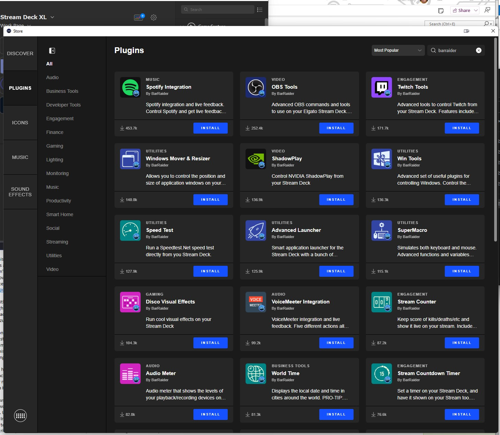
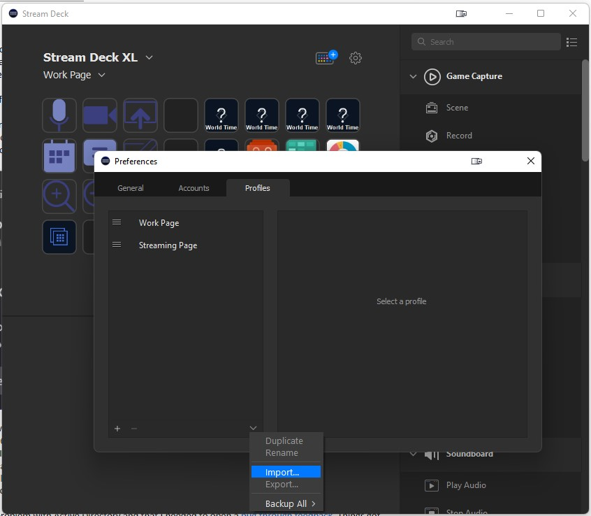

# Windows Configuration

Configuration steps, scripts and tools i use on windows machines. Feel free to skip any steps that don't work for you or add steps if you think something is missing.

## Setting up your development environment

1. Common Windows configuration changes

    - Open Explorer, click View tab, click Options, select View tab, uncheck `Hide extensions for known file types`, click OK
    - Open Settings
        - select System, select Power, select `Screen, sleep, & hibernate settings` and make necessary adjustments. Otherwise you may find your machine sleeping while you are away for a short time.
        - select Time & language, select Date & time, verify the time zone and make sure daylight saving time is enabled. For Pacific time the command-line name should be `Pacific Standard Time`, not `Pacific Standard Time_dstoff`.
        - select Personalization, select Colors, select Dark mode
        - select Windows Update, and make sure all updates are installed

2. Remove unwanted pre-installed software

    Do this before installing other applications so it is easy to distinguish
    software that came with the machine from software you installed yourself.
    The goal is to remove trialware and software that nags or advertises, not to
    remove every optional Windows or OEM application.

    Open PowerShell as administrator and inventory the installed applications:

    ```powershell
    winget list
    ```

    Keep hardware drivers and utilities until you know what they control. This
    includes chipset, storage, graphics, audio, networking, firmware update,
    function key, power management and recovery software. Quiet consumer apps
    can also be left alone unless they become annoying.

    If Norton 360 was bundled with the computer, open **Settings**, select
    **Apps**, select **Installed apps**, find **Norton 360** and uninstall it.
    Choose complete removal, decline offers to retain settings or reinstall,
    and restart the computer when prompted.

    After restarting, verify that Windows Security registers only Microsoft
    Defender:

    ```powershell
    Get-CimInstance -Namespace root/SecurityCenter2 -ClassName AntiVirusProduct |
      Select-Object displayName, productState, pathToSignedProductExe |
      Format-List
    ```

    Check that Defender's primary protections are enabled and its signatures
    are current:

    ```powershell
    Get-MpComputerStatus |
      Select-Object AMServiceEnabled, AntivirusEnabled, AntispywareEnabled,
                    RealTimeProtectionEnabled, IoavProtectionEnabled,
                    BehaviorMonitorEnabled, NISEnabled,
                    OnAccessProtectionEnabled, DefenderSignaturesOutOfDate,
                    AntivirusSignatureLastUpdated |
      Format-List
    ```

    Each protection setting should be `True`, and
    `DefenderSignaturesOutOfDate` should be `False`.

    Some OEM installations leave promotional `SoftLanding` scheduled tasks
    behind after Norton is removed. List them before deciding whether to remove
    them:

    ```powershell
    Get-ScheduledTask |
      Where-Object TaskPath -Like '\SoftLanding\*' |
      Select-Object TaskPath, TaskName, State |
      Format-Table -AutoSize
    ```

    Remove only the tasks in that folder, then verify that none remain:

    ```powershell
    Get-ScheduledTask |
      Where-Object TaskPath -Like '\SoftLanding\*' |
      Unregister-ScheduledTask -Confirm:$false

    Get-ScheduledTask | Where-Object TaskPath -Like '\SoftLanding\*'
    ```

    If Outlook is not needed, remove the new Outlook for Windows application
    and the provisioned copy that Windows would install for future users. This
    does not remove Microsoft 365, Word or Excel:

    ```powershell
    Get-AppxPackage -AllUsers -Name Microsoft.OutlookForWindows |
      ForEach-Object {
        Remove-AppxPackage -Package $_.PackageFullName -AllUsers
      }

    Get-AppxProvisionedPackage -Online |
      Where-Object DisplayName -EQ 'Microsoft.OutlookForWindows' |
      ForEach-Object {
        Remove-AppxProvisionedPackage -Online `
          -PackageName $_.PackageName -AllUsers
      }
    ```

    Verify that neither copy remains:

    ```powershell
    Get-AppxPackage -AllUsers -Name Microsoft.OutlookForWindows
    Get-AppxProvisionedPackage -Online |
      Where-Object DisplayName -EQ 'Microsoft.OutlookForWindows'
    ```

    Both commands should produce no output. Microsoft 365 may include classic
    Outlook separately; do not modify the Microsoft 365 installation merely to
    remove Outlook unless `OUTLOOK.EXE` is actually present.

    If Microsoft Teams is not needed, stop it and uninstall the package from an
    elevated Command Prompt:

    ```cmd
    taskkill /IM ms-teams.exe /F 2>nul
    winget uninstall --id Microsoft.Teams -e
    powershell.exe -NoProfile -Command "Get-AppxProvisionedPackage -Online | Where-Object DisplayName -EQ 'MSTeams' | ForEach-Object { Remove-AppxProvisionedPackage -Online -PackageName $_.PackageName -AllUsers }"
    ```

    Verify that neither the installed nor provisioned Teams package remains:

    ```cmd
    winget list --id Microsoft.Teams -e
    powershell.exe -NoProfile -Command "Get-AppxPackage -AllUsers -Name MSTeams; Get-AppxProvisionedPackage -Online | Where-Object DisplayName -EQ 'MSTeams'"
    ```

    WinGet should report that no installed package matches, and the PowerShell
    check should produce no output.

    When adding an HP printer, use **Settings**, select **Bluetooth & devices**,
    then select **Printers & scanners**. Windows may automatically install the
    printer's HP Print Support Application. Do not install HP Smart or accept
    offers for additional HP software unless a required printer feature needs
    it. If HP software starts displaying promotions, inventory the installed HP
    applications, services and scheduled tasks before removing anything needed
    by the printer.

3. Open an elevated command prompt
    
    (Press <kbd>Win</kbd>, type `Terminal`, right click and select 'Run as administrator').

    Configure the Pacific time zone, start Windows Time and synchronize the
    clock. The message `The requested service has already been started` is
    harmless.

    ```cmd
    tzutil /s "Pacific Standard Time"
    sc config w32time start= demand
    net start w32time
    w32tm /resync
    ```

    Reset and update the default WinGet sources:

    ```cmd
    winget source reset --force
    winget source update
    ```

    A new Windows installation may include an outdated App Installer. One
    symptom is WinGet error `0x8a15005e`, which says that the Microsoft Store
    server certificate did not match an expected value. Install the current
    Windows App Runtime dependency from the working WinGet community source,
    then install Microsoft's current stable App Installer package:

    ```cmd
    winget install --id Microsoft.WindowsAppRuntime.1.8 -e --source winget
    powershell.exe -NoProfile -Command "Add-AppxPackage -Path 'https://aka.ms/getwinget' -ForceApplicationShutdown"
    ```

    Verify the update and confirm that the Microsoft Store source works. Do not
    bypass certificate pinning or remove the `msstore` source.

    ```cmd
    winget --info
    winget source update
    winget search "Windows Terminal" --source msstore --accept-source-agreements
    ```

    Now install the applications:

    ```
    reg add HKLM\SOFTWARE\Microsoft\Windows\CurrentVersion\Policies\System /v EnableLinkedConnections /t REG_DWORD /d 1 /f
    winget install --id Google.Chrome -e --source winget
    winget install --id Dropbox.Dropbox -e --source winget
    winget install --id Microsoft.VisualStudio.2022.Community -e --source winget
    winget install --id Microsoft.VisualStudioCode -e --source winget
    winget install --id Microsoft.Office -e --source winget
    winget install --id Git.Git -e --source winget
    winget install --id Obsidian.Obsidian -e --source winget
    winget install --id Microsoft.PowerToys -e --source winget
    winget install --id CoreyButler.NVMforWindows -e --source winget
    winget install --id Neovim.Neovim -e --source winget
    winget install --id Anthropic.Claude -e --source winget
    winget install Codex -s msstore
    ```

    The last two lines install the AI coding desktop apps: `Anthropic.Claude` is the Claude Code desktop app, and `Codex -s msstore` is the Codex desktop app (from the Microsoft Store — accept the msstore source agreement if prompted).

    Then install the AI coding CLIs natively. These ship as self-updating PowerShell installers, so run them from a **PowerShell** window (not the cmd prompt above):

    ```powershell
    irm https://claude.ai/install.ps1 | iex            # Claude Code CLI
    irm https://chatgpt.com/codex/install.ps1 | iex    # Codex CLI
    irm https://x.ai/cli/install.ps1 | iex             # Grok Build CLI
    ```

    These install into `%USERPROFILE%\.local\bin`. If `claude`, `codex`, or `grok` isn't found in a new terminal, run the following in PowerShell to add that directory to your user PATH:

    ```powershell
    $bin = "$env:USERPROFILE\.local\bin"
    $userPath = [Environment]::GetEnvironmentVariable("Path", "User")
    if ($userPath -notlike "*$bin*") {
        [Environment]::SetEnvironmentVariable("Path", "$userPath;$bin", "User")
    }
    ```

    Do not use the WinGet package `Microsoft.Office` for a personal or family
    Microsoft 365 subscription; that package installs Microsoft 365 Apps for
    enterprise. If Word and Excel are not already present, sign in at
    [Microsoft 365 Apps](https://m365.cloud.microsoft/apps) using the Microsoft
    account associated with the subscription and select **Install apps**.

4. Find the Welcome to Power Toys window

    - click the `Open Settings` button
    - select General blade
    - click `Restart PowerToys as administrator`
    - select General blade again
    - check Always run as administrator
    - select FancyZones under Windowing & Layouts
    - click `Open layout editor`
    - click `Create new layout`
    - name it "Grid", click `Grid` and click `Create`
    - arrange at least 2 rows of 4 squares and click `Save`
    - select FancyZones under Windowing & Layouts
    - turn on `Override Windows Snap`
    - Set `Move windows based on` to `Relative position`

5. Close and reopen an elevated command prompt and run the following

    ```
    nvm install lts
    nvm use lts
    node -v
    npm -v
    wsl --install
    shutdown /r /f /t 0
    ```

6. Reopen an elevated command prompt and run the following

    ```
    wsl --list --online
    wsl --install Ubuntu
    cd %USERPROFILE%
    md bin
    code bin\init.cmd bin\cmds.lst
    ```

7. For Init.cmd put the following

    ```
    @echo off
    set PATH=%PATH%;%~dp0
    if exist "c:\Program Files\Microsoft Visual Studio\18\Community\Common7\Tools\VsDevCmd.bat" call "c:\Program Files\Microsoft Visual Studio\18\Community\Common7\Tools\VsDevCmd.bat" -arch=amd64 -host_arch=amd64
    alias -f "%USERPROFILE%\Bin\cmds.lst"
    pushd "y:\xxx\repos"
    ```

8. Copy alias.exe into %USERPROFILE%\Bin if you haven't already.

    For cmds.lst put the following

    ```
    home pushd "%USERPROFILE%\Desktop"
    self pushd "%USERPROFILE%"
    bin  pushd "%USERPROFILE%\Bin"
    dev  pushd "y:\xxx\repos"
    ```

9. click the caret on the Terminal window and select Settings

10. click `Add a new profile`, select Duplicate `Command Prompt` and press `Duplicate`

    - rename to `Dev Shell`
    - update Command line to `%SystemRoot%\System32\cmd.exe /k "%USERPROFILE%\Bin\Init.cmd"`
    - click `Save`
    - click `Startup`
    - select `Dev Shell` as default profile
    - click `Save`

11. Back at the elevated command prompt, run the following

    ```
    git config --global user.name "Your Name Here"
    git config --global user.email "your_email@example.com"
    
    git config --global color.ui auto
    git config --global push.default simple
    git config --global core.filemode false
    git config --global fetch.prune true
    git config --global pull.rebase true
    git config --global core.autocrlf true
    git config --global core.safecrlf false
    
    git config --global alias.lga "log --graph --oneline --all --decorate"
    git config --global alias.sync "pull --rebase --autostash"

    git config --global core.editor nvim

    git config --global --add safe.directory '*'
    ```

12. Copy `.gitmessage` to %USERPROFILE%

    ```cmd
    copy .gitmessage %USERPROFILE%
    git config --global commit.template "%USERPROFILE%\.gitmessage"
    ```
  
13. Update hosts file

    Enter the following command in your dev window

    ```
    code C:\Windows\System32\drivers\etc\hosts
    ```
    add the following line to the end
    ```
    127.0.0.1 local.<yourdomainname>.com
    ```

14. Install Node in WSL (Ubuntu)

    Node inside WSL is managed exclusively via nvm.  Do not install Node via apt.

    Open an Ubuntu WSL terminal and run:

    ```bash
    curl -o- https://raw.githubusercontent.com/nvm-sh/nvm/v0.39.7/install.sh | bash
    source ~/.bashrc
    nvm install --lts
    nvm use --lts
    node -v
    npm -v
    sudo apt update
    ```

15. Install the AI coding CLIs in WSL (Ubuntu)

    Inside the same Ubuntu WSL terminal (after Node is set up), install the CLIs with their official Linux installers:

    ```bash
    curl -fsSL https://claude.ai/install.sh | bash        # Claude Code CLI
    curl -fsSL https://chatgpt.com/codex/install.sh | sh  # Codex CLI
    curl -fsSL https://x.ai/cli/install.sh | bash         # Grok Build CLI
    ```

    Verify with `claude --version`, `codex --version`, and `grok --version`.

16. Install essential [VS Code extensions](../docs/vscode/README.md)

17. Install [my extension](https://github.com/seank-com/number-it)

    Run the following from a command console

    ```dos
    npm install
    npx vsce package
    code --install-extension number-it-0.0.1.vsix
    ```

18. Install other tools

    ```
    winget install --id Discord.Discord -e --source winget
    winget install --id Zoom.Zoom -e --source winget
    winget install --id ScooterSoftware.BeyondCompare4 -e --source winget
    winget install --id BinaryFortress.DisplayFusion -e --source winget
    winget install --id Unity.UnityHub -e --source winget
    winget install --id OBSProject.OBSStudio -e --source winget
    winget install --id BlenderFoundation.Blender -e --source winget
    winget install --id Voicemod.Voicemod -e --source winget
    winget install --id Valve.Steam -e --source winget
    winget install --id Overwolf.CurseForge -e --source winget
    winget install --id Docker.DockerDesktop -e --source winget
    winget install --id Elgato.StreamDeck -e --source winget
    ```

    Install [Battle.net](https://download.battle.net/en-us/desktop) using Blizzard's
    installer. Its WinGet package requires an awkward explicit installation path
    and is not useful for this setup. After signing in, install World of Warcraft
    from within Battle.net. CurseForge is the add-on manager; World of Warcraft
    itself is not installed by WinGet.

    Click the button-plus icon along the center top (to the left of the gear) to install plugins. In the search enter "barraider" and install "Speed Test" and "World Time"

    

    Click the gear icon, go to the Profiles tab and click the dropdown to Import

    

18. Install Handy (Optional - helpful for transcribing speech into notes)

    Handy is a free, open-source speech-to-text application that works entirely offline. Since there doesn't appear to be a winget command for it yet, it will need to be downloaded manually.

    - Visit [https://handy.computer](https://handy.computer)
    - Navigate to [https://handy.computer/download](https://handy.computer/download)
    - Click on "Windows x64 .exe" (approximately 12.6MB)
    - Run the downloaded installer and follow the installation wizard
    - Launch Handy and grant microphone and accessibility permissions when prompted
    - If prompted to select a model, Parakeet V3 is recommended (works well)
    - The default keyboard shortcut is typically <kbd>Ctrl</kbd>+<kbd>Spacebar</kbd>

19. Install AutoHotkey and configure clipboard-to-keystrokes

    Install AutoHotkey v2:

    ```cmd
    winget install --id AutoHotkey.AutoHotkey -e --source winget
    ```

    Create `%USERPROFILE%\Bin\ClipboardTyper.ahk` with the following contents:

    ```ahk
    #Requires AutoHotkey v2.0
    #SingleInstance Force

    ^+v::{
        KeyWait "Ctrl"
        KeyWait "Shift"
        SendText A_Clipboard
    }
    ```

    This makes <kbd>Ctrl</kbd>+<kbd>Shift</kbd>+<kbd>V</kbd> type the current
    clipboard contents as text instead of issuing a paste command. This is useful
    for password fields and other controls that block clipboard paste.

    Configure the script to run at sign-in:

    - Press <kbd>Win</kbd>+<kbd>R</kbd>, enter `shell:startup`, and press <kbd>Enter</kbd>
    - In the Startup folder, create a shortcut to `%USERPROFILE%\Bin\ClipboardTyper.ahk`
    - Double-click the shortcut to start the script immediately
    - Test it by copying some text, focusing a text field, and pressing
      <kbd>Ctrl</kbd>+<kbd>Shift</kbd>+<kbd>V</kbd>
