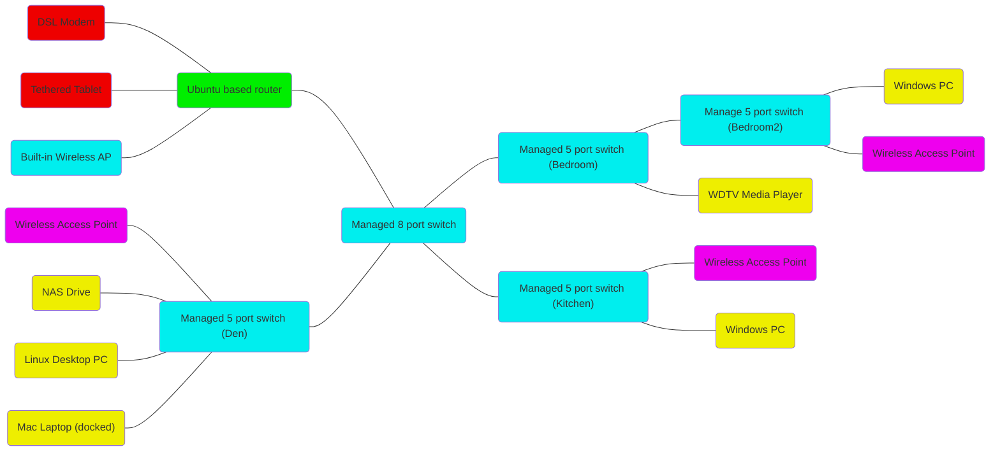

## Introduction

These instructions are for building an Unbuntu based router with the [Thin Mini
PC with Intel Celeron j1900 processor onboard, quad core 2.42 GHz, 8G ram 128G
SSD 300M WIFI, dual nic 720P/1080P HD video dual LAN dual HDMI COM Mini
Pc](https://www.amazon.com/gp/product/B01M3WPT91/) that I got from Amazon for my
home router.

I was originally going to install pfSense on it as it indicated that it was
supported. However I found out that [Broadcom Wifi board is not
support](https://www.reddit.com/r/freebsd/comments/4g1hdh/broadcom_diver_wmib275n_half_card_wifi/)
in pfSense and so it would not work for my purposes. Before packing it up and
sending it back I decided to look and see if ubuntu could be coaxed into doing
the job. I found
[two](https://help.ubuntu.com/community/Router#Dedicated_Hardware)
[pages](https://help.ubuntu.com/community/EasyRouter) that discussed using
ubuntu as a router. As well as pages that indicated that the [broadcom
WiFi](http://askubuntu.com/questions/55868/installing-broadcom-wireless-drivers)
and a
[tethered](http://askubuntu.com/questions/724238/connection-to-the-internet-via-smartphone-usb-tethering)
[android](http://www.junauza.com/2012/07/how-to-tether-android-smartphone-to.html)
would be supported.

## The Goal
Here is the target network topology. The router (green box) would load balance
all connections across to the internet between the DSL Modem and Tethered Tablet
(red boxes). The managed switches (cyan boxes) would create two vlans. One for
the wireless access points (purple boxes) and One for the wire connected devices
(yellow boxes).



## Install Ubuntu from Live USB Drive

So without further ado, here are the steps I took to stand-up an Ubuntu router.
Your mileage may vary and I certainly hope it is easier for you than it was for
me.

1. Follow the steps to [create a bootable USB
   stick](https://www.ubuntu.com/download/desktop/create-a-usb-stick-on-macos)
   with the latest version of Ubuntu Desktop. _**Note:** I had to first Fat32
   format my USB stick before it would show up in UNetbootin. The only way I
   know how to do this on a Mac is to use Windows like so:_
  - Click eject on the ThumbDrive from the Finder.
  - Launch VirtualBox and boot your Windows 10 VM _**Note:** it might be
    necessary to install the [extension
    pack](https://www.virtualbox.org/wiki/Downloads) if you haven't done so
    already_
  - Select your device from the **USB Device** menu under the **Devices** menu
  - Open Explorer in the Windows 10 VM and right-click the ThumbDrive and select
    Format.
  - Shutdown your VM
2. Insert USB stick in router hardware and boot. To understand the choices
   below, refer to the [Ubuntu Installation
   Guide](https://help.ubuntu.com/lts/installation-guide/)
3. Select either **Try Ubuntu without installing** and then double click the
   **Install Ubuntu** icon on the desktop or select **Install Ubuntu**
4. Choose English
5. Check **Download updates while installing Ubuntu** but leave **Install
   third-party software for graphics and Wi-Fi hardware, Flash, MP3 and other
   media** unchecked
6. Check **Use LVM with the new Ubuntu installation**
7. Select you time zone
8. Select your keyboard layout
9. Choose a user name and password
10. Boot Ubuntu and sign in
11. From Terminal (Press Ctrl-Alt-T) enter the following commands:

  ```bash
  # Fetch the list of available updates
  sudo apt-get update
  # Strictly upgrade the current packages
  sudo apt-get upgrade
  # Install update (new ones)
  sudo apt-get dist-upgrade
  # Remove obsolete packages
  sudo apt-get autoremove
  ```

## Basic Configuration changes

### Install atom
- From Terminal (Press Ctrl-Alt-T) enter the following commands:

  ```bash
  # add atom repository
  sudo add-apt-repository ppa:webupd8team/atom
  # upgrade current packages (if any)
  sudo apt-get update
  # not that we know where to find it, install it
  sudo apt-get install atom
  ```
- Goto Edit | Preferences | Install
  - Enter 'sort-lines' and press **Packages**
  - Install **sort-lines** Packages
  - Repeat for **atom-mermaid**
- Goto Edit | Preferences | Open Config Folder
  - Click **config.cson** and append the following

  ```coffee
    welcome:
      showOnStartup: false
  ```

### Remove Guest account from login screen
- From Terminal enter the following commands:

  ```bash
  sudo atom /etc/lightdm/lightdm.conf.d/50-no-guest.conf
  ```
- enter the following

  ```
  [SeatDefaults]
  allow-guest=false
  ```

### Enable passwordless sudo
- From Terminal (Press Ctrl-Alt-T) enter the following commands:

  ```bash
  sudo visudo
  ```
- append the following line to the end of the file where bozo is the account
  name you chose

  ```
  bozo ALL=(ALL) NOPASSWD: ALL
  ```

## Test Network configuration using NetworkManager

  I believe we will ultimately need to configure everything by hand but we can
  at least test everything the easy way.

### Determine network interfaces

After experimenting with ```ifconfig```, ```ip addr``` and ```ethtool``` I
finally stumble across the command below that provides enough information to
figure out where everything is and what it is called.

- Connect your tablet via USB and put it in Tethered Mode
- Connect a laptop to one of the ethernet jacks
- From Terminal enter the following commands:

  ```bash
  sudo lshw -class network
  ```

  You should see something like this
  ```
  *-network
     description: Ethernet interface
     product: RTL8111/8168/8411 PCI Express Gigabit Ethernet Controller
     ...
     logical name: enp1s0
     ...
     serial: 00:0e:c4:ce:f8:43
     ...
     configuration: ... link=no
     ...
*-network
     description: Ethernet interface
     product: RTL8111/8168/8411 PCI Express Gigabit Ethernet Controller
     ...
     logical name: enp3s0
     ...
     serial: 00:0e:c4:ce:f8:44
     ...
     configuration: ... ip=10.42.1.1 ... link=yes
     ...
*-network:0
     description: Wireless interface
     ...
     logical name: wlp2s0b1
     serial: 20:e5:2a:fe:ab:29
     ...
     configuration: ... link=np
     ...
*-network:1
     description: Ethernet interface
     ...
     logical name: enp0s20u4u4
     serial: 02:04:35:69:62:39
     ...
     configuration: ... ip=192.168.42.115 link=yes
     ...
  ```
- From this we glean the following

| network interfaces | MAC address | Description |
|---|---|---|
| enp1s0 | 00:0e:c4:ce:f8:43 | unconnected ethernet port (link=no) |
| enp3s0 | 00:0e:c4:ce:f8:44 | connected ethernet (link=yes) |
| wlp2s0b1 | 20:e5:2a:fe:ab:29 | builtin wireless |
| enp0s20u4u4 | 02:04:35:69:62:39 | Thethered Tablet |

### Configure Ethernet as shared LAN

So next we want to configure the connected ethernet as our LAN connection as
follows

- Select **Edit Connections** from the network menu
- Select a **Wired connection** and click **Edit** until you find the one with
  the MAC address matching your connected ethernet interface
- Select the IPv4Settings tab
- Choose **Shared to other computer** as the Method and click **Save**

### Configure Wi-Fi as Hotspot

After this we are ready to configure a Wi-Fi Hotspot on our builtin wireless as
follows

- Select **Edit Connections** from the network menu
- Click **Add**
- Choose **Wi-Fi**
- Uncheck **Automatically connect to this network when it is available**
- Enter SSID
- Choose **Hotspot** Mode
- For Device use **20:E5:2A:FE:AB:29** _(you might need to find the mac address
  of your Wi-Fi card. This is mine.)_
- For Security select **WPA & WPA2 Personal**
- Enter password _(must be long enough or Save button will be disabled)_
- For IPv4 Settings select **Shared to other computers** for Method
- Click **Save**
- **Close** Edit Connections
- Select **Create New Wi-Fi Network...** from network menu
- Under connect choose **Wi-Fi connection 1** and press Create
- Edit **/etc/NetworkManager/system-connections/Wi-Fi\ connection\ 1** and
  change autoconnect to true


### WTF

At this point almost everything should be working like magic. I'm reasonably
confident I can attach the unconnected ethernet to my DSL modem and get that
working without too much trouble (load balancing is another matter). However,
here is the problem. How is it working? How do we configure it they way we want?
Specifically, we need to determine the following:
- How are the wired and wireless connections being assigned IP addresses?
- Who is doing or proxying DNS resolution?
- How is IP masquerading being happening?
- Is there a firewall?
- If so, who is configuring it and what ports are open?
- Is iptables routing everything?
- If so, who is configuring the iptables?

### Collecting Data

In order to get an idea of what is going on we will need to collect a few data
files.

- From Terminal enter the following

  ```bash
  # make a directory for the data and go there
  mkdir ~/notes
  cd ~/notes
  # list all installed packages
  dpkg --get-selections | grep -v deinstall >installed_packages.txt
  ps -ef >running_processes.txt
  ```

http://www.netfilter.org/documentation/HOWTO/packet-filtering-HOWTO-7.html

http://www.netfilter.org/documentation/HOWTO/NAT-HOWTO.html

http://superuser.com/questions/681993/using-dnsmasq-with-networkmanager

http://askubuntu.com/questions/155716/configuring-the-dnsmasq-instance-started-by-connection-sharing-in-networkmanager

http://192.168.0.1/

http://askubuntu.com/questions/590920/ubuntu-14-04-as-a-gateway-router-and-a-firewall

http://opensourceforu.com/2015/04/how-to-configure-ubuntu-as-a-router/

https://help.ubuntu.com/lts/serverguide/network-configuration.html

http://askubuntu.com/questions/691986/network-manager-shared-connection-and-manual-settings-of-the-interface

https://www.cyberciti.biz/faq/linux-setup-default-gateway-with-route-command/

http://askubuntu.com/questions/557085/how-to-setup-ubuntu-router-with-2-wan-interfaces

https://help.ubuntu.com/community/Router#Dedicated_Hardware

https://help.ubuntu.com/community/IptablesHowTo
https://www.digitalocean.com/community/tutorials/how-the-iptables-firewall-works
https://www.digitalocean.com/community/tutorials/how-to-set-up-a-firewall-using-iptables-on-ubuntu-14-04
https://www.unixmen.com/iptables-vs-firewalld/

http://manpages.ubuntu.com/manpages/xenial/en/man8/ufw.8.html

https://support.rackspace.com/how-to/checking-listening-ports-with-netstat/

https://wiki.ubuntu.com/vlan

https://help.ubuntu.com/community/Internet/ConnectionSharing

http://askubuntu.com/questions/11271/how-to-setup-multiple-wans-with-load-balancing

https://ubuntuforums.org/showthread.php?p=8129464

fail2ban

## Add VLan
- From Terminal enter the following

  ```
  sudo apt-get install vlan
  ```


-

-

-

-

-

-

-

-

-

-

-

-

Ethernet interface: enp1s0
Ethernet interface: enp3s0
Wireless interface: wlp2s0b1
Tethered Tablet Ethernet interface: enp0s20u4u4

/usr/sbin/dnsmasq --no-resolv --keep-in-foreground --no-hosts --bind-interfaces --pid-file=/var/run/NetworkManager/dnsmasq.pid --listen-address=127.0.1.1 --cache-size=0 --proxy-dnssec --enable-dbus=org.freedesktop.NetworkManager.dnsmasq --conf-dir=/etc/NetworkManager/dnsmasq.d
/usr/sbin/dnsmasq --conf-file --no-hosts --keep-in-foreground --bind-interfaces --except-interface=lo --clear-on-reload --strict-order --listen-address=10.42.0.1 --dhcp-range=10.42.0.10,10.42.0.254,60m --dhcp-option=option:router,10.42.0.1 --dhcp-lease-max=50 --pid-file=/var/run/nm-dnsmasq-wlp2s0b1.pid --conf-dir=/etc/NetworkManager/dnsmasq-shared.d
/usr/sbin/dnsmasq --conf-file --no-hosts --keep-in-foreground --bind-interfaces --except-interface=lo --clear-on-reload --strict-order --listen-address=10.42.1.1 --dhcp-range=10.42.1.10,10.42.1.254,60m --dhcp-option=option:router,10.42.1.1 --dhcp-lease-max=50 --pid-file=/var/run/nm-dnsmasq-enp3s0.pid --conf-dir=/etc/NetworkManager/dnsmasq-shared.d


google Arch Linux stateful firewall
